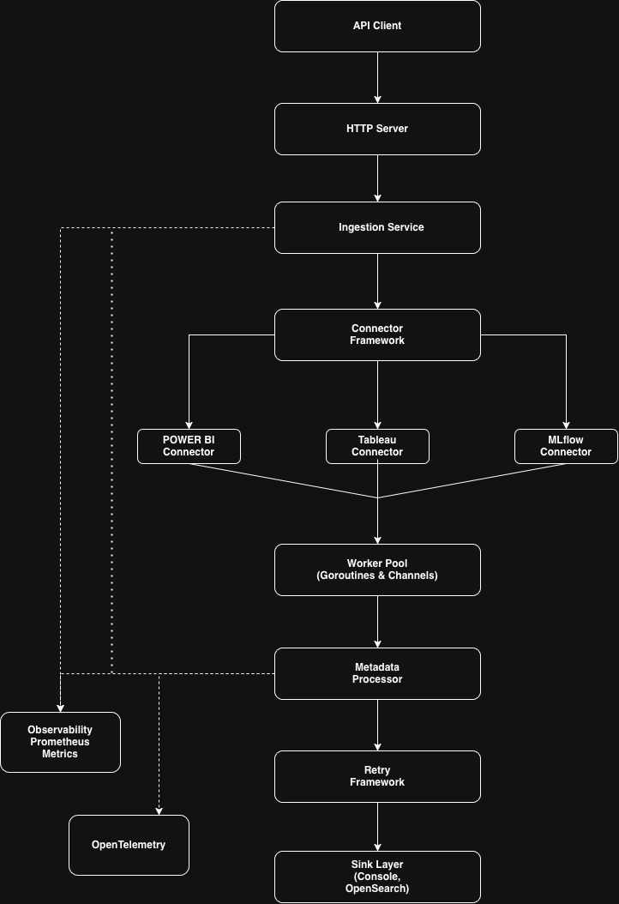

# Metadata Ingestion Service

> **Demonstrates:** Go • Worker Pools • Concurrent Processing • Clean Architecture • OpenTelemetry • Prometheus • Docker • Dependency Injection • Strategy Pattern • Retry Pattern • Backend System Design


A production-style metadata ingestion service written in Go that demonstrates scalable backend architecture, concurrent processing, observability, and extensible connector/sink design.

Inspired by enterprise metadata platforms, the service ingests metadata from multiple sources, processes it concurrently using a configurable worker pool, and publishes it to pluggable sinks while exposing metrics and distributed traces.

---

# Highlights

- Concurrent metadata ingestion using worker pools
- Pluggable connector architecture
- Pluggable sink architecture
- Retry with exponential backoff
- Context propagation and graceful shutdown
- Prometheus metrics
- OpenTelemetry tracing
- Docker support
- GitHub Actions CI
- Clean Architecture with dependency injection

---

# Architecture

<p align="center">
  
</p>

---

# Technology Stack

| Category | Technology |
|-----------|------------|
| Language | Go 1.26 |
| Logging | Zap |
| Metrics | Prometheus |
| Tracing | OpenTelemetry |
| Containerization | Docker |
| CI | GitHub Actions |

### Design Patterns

- Worker Pool
- Dependency Injection
- Strategy Pattern
- Retry Pattern

---

# Project Structure

```text
.
├── cmd/
│   └── app/
├── internal/
│   ├── app/
│   ├── config/
│   ├── connectors/
│   ├── ingestion/
│   ├── logger/
│   ├── metrics/
│   ├── models/
│   ├── processor/
│   ├── retry/
│   ├── server/
│   ├── sink/
│   └── telemetry/
└── README.md
```

---

# Features

## Connectors

| Connector | Status |
|------------|--------|
| Power BI | ✅ |
| CSV | ✅ |

Additional connectors can be added by implementing the `Connector` interface.

---

## Sinks

| Sink | Status |
|-------|--------|
| Console | ✅ |
| OpenSearch | ✅ |

The active sink is selected using configuration.

---

# Configuration

The service is configured using environment variables.

| Variable | Default | Description |
|----------|----------|-------------|
| HTTP_PORT | 8080 | HTTP server port |
| WORKER_COUNT | Number of CPU cores | Concurrent workers |
| JOB_QUEUE_SIZE | 100 | Buffered job queue size |
| SINK_TYPE | console | console / opensearch |
| OPENSEARCH_URL | http://localhost:9200 | OpenSearch endpoint |
| OPENSEARCH_INDEX | metadata | OpenSearch index |

Example:

```bash
cp .env.sample .env
```

---

# Running Locally

## Prerequisites

- Go 1.26+
- Docker (optional)

Clone the repository.

```bash
git clone https://github.com/mohammedimrankasab/Metadata-Ingestion-Service.git

cd Metadata-Ingestion-Service
```

Run the service.

```bash
make run
```

Or start using Docker.

```bash
docker compose up --build
```

The application will be available at:

```
http://localhost:8080
```

Metrics:

```
http://localhost:8080/metrics
```

---

# Development

```bash
make run
make build
make test
make cover
make coverage
make fmt
make vet
```

---

# REST API

| Method | Endpoint | Description |
|---------|----------|-------------|
| GET | `/health` | Health check |
| GET | `/ready` | Readiness check |
| POST | `/ingest` | Starts metadata ingestion |

Example:

```bash
curl -X POST http://localhost:8080/ingest
```

Response

```json
{
  "message": "Ingestion started"
}
```

---

# Processing Flow

```text
HTTP Request
      │
      ▼
 Connector(s)
(Power BI / CSV)
      │
      ▼
 Metadata Jobs
      │
      ▼
 Buffered Queue
      │
      ▼
 Worker Pool
      │
      ▼
 Processor
      │
      ▼
 Configured Sink
(Console / OpenSearch)
```

---

# Concurrency Model

The ingestion pipeline is built around a configurable worker pool.

- Buffered job queue
- Configurable worker count
- Goroutines
- Channels
- WaitGroup synchronization
- Context cancellation
- Graceful shutdown

---

# Concepts Demonstrated

- Clean Architecture
- Interfaces
- Dependency Injection
- Goroutines
- Channels
- Worker Pools
- Retry Pattern
- Strategy Pattern
- Context Propagation
- Prometheus Metrics
- OpenTelemetry
- REST APIs
- Docker
- CI/CD

---

# Future Improvements

- Incremental synchronization
- Additional connectors (Tableau, MLflow)
- Kubernetes deployment manifests
- Persistent job queue
- OpenAPI documentation

---

# License

Licensed under the MIT License.